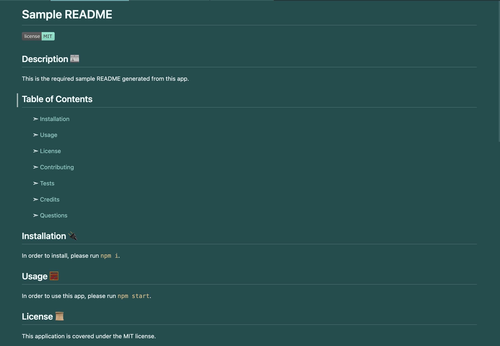

# README Generator

## Description 📰

I was motivated to make this app in order to have an easier way to make README files. Normally I'd have to google a template, copy, paste, and fill it in to my liking. With this app, now I just answer a short question prompt that will take my answers and generate it all into a neat and structured README file.

This solves the problem of time and effort that can now be more focused on actual coding.
In making this, I learned how to invoke (require) different modules, how to pass info both to a function and pass it back into the original instance of the function call (ie: generateMarkdown()). I also got an introduction to new folder structures.

## Table of Contents

&nbsp;&nbsp;&nbsp;&nbsp;&nbsp;&nbsp; ➣ [Installation](#Installation)

&nbsp;&nbsp;&nbsp;&nbsp;&nbsp;&nbsp; ➣ [Usage](#Usage)

&nbsp;&nbsp;&nbsp;&nbsp;&nbsp;&nbsp; ➣ [License](#License)

&nbsp;&nbsp;&nbsp;&nbsp;&nbsp;&nbsp; ➣ [Contributing](#Contributing)

&nbsp;&nbsp;&nbsp;&nbsp;&nbsp;&nbsp; ➣ [Tests](#Tests)

&nbsp;&nbsp;&nbsp;&nbsp;&nbsp;&nbsp; ➣ [Credits](#Credits)

&nbsp;&nbsp;&nbsp;&nbsp;&nbsp;&nbsp; ➣ [Questions](#Questions)

## Installation 🔌

In order to install, please run `npm i`.

## Usage 🧮

In order to use this app, please run `npm start`.

Please [watch this video](https://watch.screencastify.com/v/wwVlHYyojtDy5qeow0Hm) for a walkthrough of how to use the README Generator.

Here is an image of a completely generated README with licenses and credits also opted in.
If user doesn't have either one, those sections will simply not populate.

 
## License 📜
  
This application is covered under the MIT license.
I didn't really use a license. But for the purpose of this assignment, I used this generator, and I think badges look kind of cool, and I like the color I gave it, so, I'm putting it on.

## Contributing 🍴

In order to contribute, one must fork their repository and create a pull request.

## Tests ⚖️

In order to test, please run `npm test`.

 ## Credits 🤝

  M. Meyers (TA): Validation lines in index.js (lines 8, 9, 87)

## Questions 📭

Please enjoy my work at my GitHub, @[mintyry](https://github.com/mintyry).

For any additional inquiries, please [email me](mailto:dontworry@aboutit.com).
